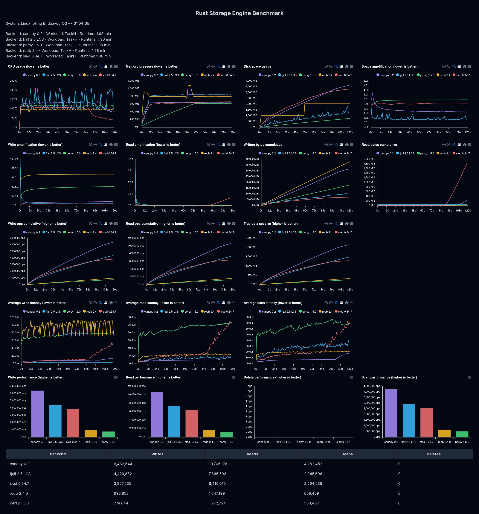
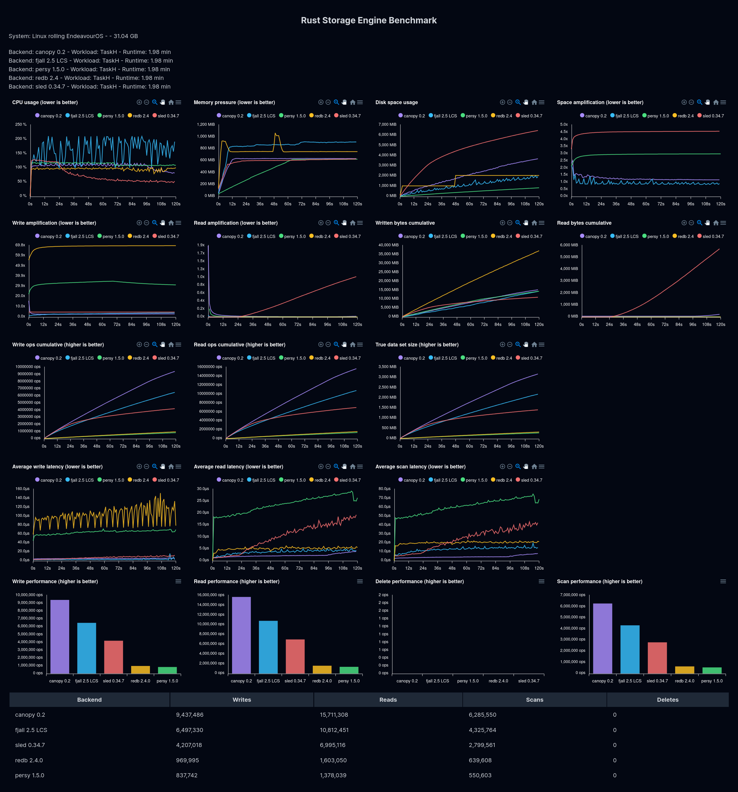
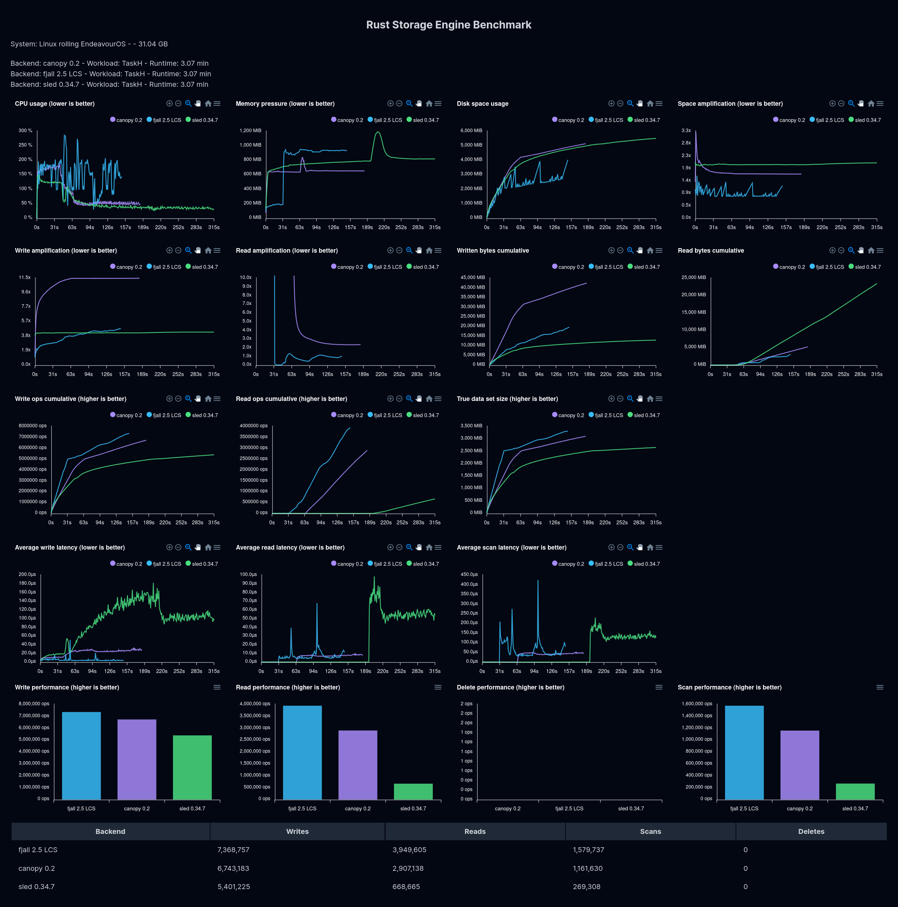
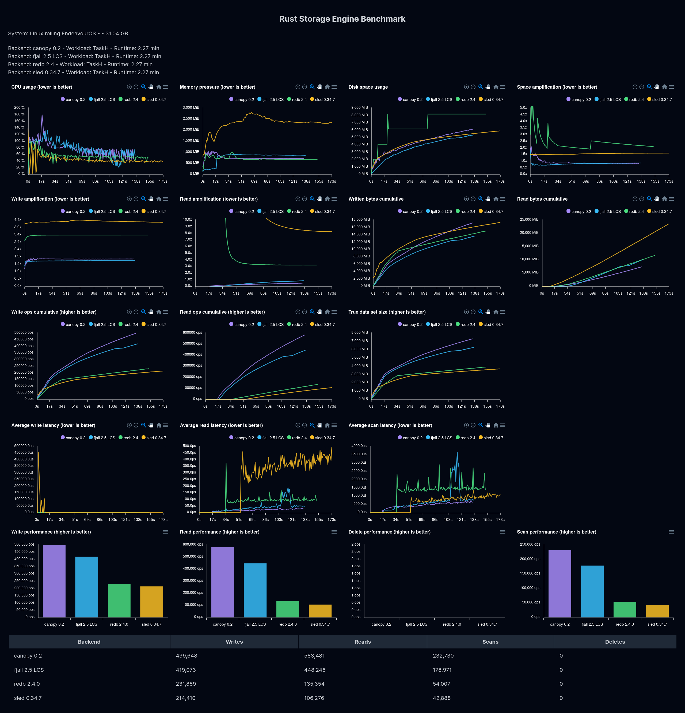

# Benchmarks

Since this crate is performance-oriented, it needs some comparisons. Benchmarks can be confusing and misleading, so take everything with a pinch of salt.

If you have questions or suggestions for improvement, please open an issue and/or PR.

* [redb benchmarks](#redb-benchmarks)
* [rust-storage-bench benchmarks](#rust-storage-bench-benchmarks)

## redb benchmarks

Benchmarks from <https://github.com/cberner/redb>, with [slight changes][redb commit]

[redb commit]: https://github.com/arthurprs/redb/tree/canopy-benchmarks

* All operations are random (including bulk)
* The workload fits in memory, and all commits are synchronous
* Databases are configured with sync commits and 4GB page cache when applicable
* Sled is listed for reference but it's *not* using transactions in the benchmark
* Rocksdb is using the Optimistic Db mode
* Benchmarks ran in an x64 Linux OS with 32GB of main memory and an Intel i9-12900H CPU with turbo boost disabled

### redb `lmdb_benchmark`

|                           | redb       | lmdb       | canopydb   | rocksdb        | sled       | sanakirja |
|---------------------------|------------|------------|------------|----------------|------------|-----------|
| bulk load                 | 3499ms     | **1466ms** | 2858ms     | 6597ms         | 7159ms     | 1544ms    |
| individual writes         | 553ms      | 879ms      | **404ms**  | 781ms          | 1124ms     | 916ms     |
| batch writes              | 2055ms     | 905ms      | 555ms      | **506ms**      | 1073ms     | 1411ms    |
| len()                     | 0ms        | **0ms**    | 0ms        | 300ms          | 631ms      | 34ms      |
| random reads              | 1293ms     | **859ms**  | 995ms      | 3397ms         | 2118ms     | 1273ms    |
| random reads              | 1242ms     | **861ms**  | 980ms      | 3387ms         | 2114ms     | 1270ms    |
| random range reads        | 1756ms     | **635ms**  | 1088ms     | 3070ms         | 3497ms     | 827ms     |
| random range reads        | 1766ms     | **624ms**  | 1089ms     | 3057ms         | 3470ms     | 830ms     |
| random reads (4 threads)  | 892ms      | **504ms**  | 650ms      | 1901ms         | 1296ms     | 860ms     |
| random reads (8 threads)  | 586ms      | **307ms**  | 437ms      | 1372ms         | 884ms      | 3208ms    |
| random reads (16 threads) | 391ms      | **176ms**  | 263ms      | 786ms          | 522ms      | 10276ms   |
| random reads (32 threads) | 349ms      | **156ms**  | 234ms      | 616ms          | 428ms      | 12254ms   |
| removals                  | 2444ms     | **1029ms** | 2279ms     | 3382ms         | 3219ms     | 1457ms    |
| size before compaction    | 771.51 MiB | 583.27 MiB | 670.20 MiB | **384.74 MiB** | 462.01 MiB | 4.00 GiB  |
| compaction                | 978ms      | **216ms**  | 656ms      | 775ms          | N/A        | N/A       |
| size after bench          | 341.28 MiB | 279.39 MiB | 349.24 MiB | **97.49 MiB**  | 462.01 MiB | 4.00 GiB  |

How to reproduce:

* checkout [redb commit]
* run `cargo +stable bench --bench lmdb_benchmark`

### redb `int_benchmark`

|           | redb   | lmdb  | canopydb | rocksdb | sled   | sanakirja |
|-----------|--------|-------|----------|---------|--------|-----------|
| bulk load | 5020ms | 746ms | 576ms    | 5237ms  | 4898ms | 759ms     |

Notes:

* This benchmark bulk loads 1000000 u32 keys and u64 values in 1 transaction
* Despite the fixed key/value sizes and bulk load behavior, no special configurations are utilized

How to reproduce:

* checkout [redb commit]
* run `cargo +stable bench --bench int_benchmark`

### redb `large_values_benchmark`

|                        | redb    | lmdb   | canopydb | rocksdb | sled    |
|------------------------|---------|--------|----------|---------|---------|
| bulk load (2MB values) | 18050ms | 9001ms | 19369ms  | 25578ms | 42775ms |

Notes:

* This benchmarks bulk loads 4000 2MB items and 1000000 small items in 1 transaction
* Despite the bulk load behavior, no special configurations are utilized.

How to reproduce:

* checkout [redb commit]
* run `cargo +stable bench --bench large_values_benchmark`
* Rocksdb uses *a lot* of memory in this benchmark and may OOM when reproducing

## `rust-storage-bench` benchmarks

<https://github.com/marvin-j97/rust-storage-bench> from the author of [Fjall](https://github.com/fjall-rs/) with [changes][storage bench commit].

[storage bench commit]: https://github.com/arthurprs/rust-storage-bench/tree/impl-canopy

* Databases are configured with a 512MB page cache when applicable, and memory is limited to 4GB.
* Values are 512B unless otherwise stated. The values are compressible, which is relevant for databases with compression.
* Reads, scans, and overwrites follow a Zipfian distribution (s=1) biased towards the most recent writes.
* Inserts target non-existing keys at a random point in the keyspace unless specified as sequential, which is at the end.
* Async commit is used unless specified otherwise
* Single-threaded benchmarks
* Fjall and Sled are *not* using transactions, which may give them an advantage.
* Redb doesn't have an async commit mode, so in the *non* sync-commit benchmarks, it performs a sync commit every 1000th insert to avoid disk space blowout.
* LMDB doesn't have a safe async commit mode, so it's not included in async commit benchmarks.
* Sled doesn't have a safe sync commit mode, so it's not included in the sync commit benchmarks.
* Benchmarks ran in a x64 Linux OS and a Intel i9-12900H CPU with turbo boost disabled

### Workload H - 50% reads, 20% scans, 10% overwrites and 20% inserts

### Workload H - 50% reads, 20% scans, 10% overwrites, and 20% inserts (sequential)

### Workload H (large) - 50% reads, 20% scans, 10% overwrites, and 20% inserts

Bulk loaded with 5M entries. The intent is to capture performance in larger-than-memory workloads. Databases with too low insert performance aren't shown.

### Workload H (large) - 20K values, 50% reads, 20% scans, 10% overwrites, and 20% inserts

Bulk loaded with 150K entries, values are 20KB. The intent is to capture performance in larger-than-memory workloads. Databases with too low insert performance aren't shown.

### Workload G - 95% inserts, 5% reads (*sync* commit)

### Reproduction

How to reproduce:

* checkout the [commit][storage bench commit]
* run `bash run.sh`
  * Prefix the command with `systemd-run --scope -p MemoryLimit=4G` (on Linux) to limit memory of the benchmark
* enter the `page` folder and run `npm run dev`
* open <http://localhost:5173/rust-storage-bench/> and drag-and-drop related benchmark files to the page
